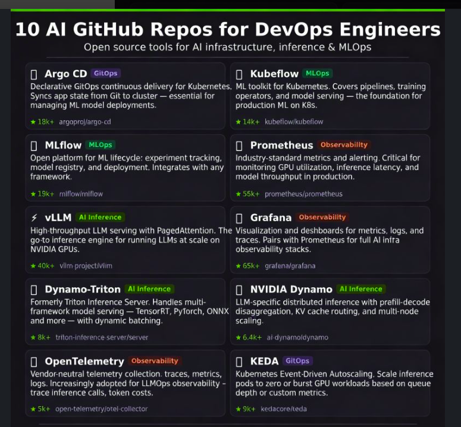

# AWS-Devops

**Let's Learn And Explore The Best AWS-DevOps Practices.
Here are the top 10 engineering blogs(Across Different Domains)that I Recommend To Grow:**

1)https://medium.com/airbnb-engineering/dynamic-kubernetes-cluster-scaling-at-airbnb-d79ae3afa132  
2)https://openai.com/index/scaling-postgresql/  
3)https://github.blog/engineering/  
4)https://blog.cloudflare.com/tag/engineering/  
5)https://stripe.com/blog/engineering  
6)https://cloud.google.com/blog/  
7)https://aws.amazon.com/blogs/architecture/  
8)https://www.anthropic.com/engineering  
9)https://www.uber.com/en-IN/blog/engineering/  #Consistently Posted  
10)https://netflixtechblog.com/empowering-netflix-engineers-with-incident-management-ebb967871de4  

## Recommended Open-Source Repositories
**Focus: DevOps, MLOps, AI Infra & Observability**

As a DevOps Engineer, understanding how AI systems run in production is quickly becoming a vital skill. These 10 open-source projects sit at the intersection of infrastructure, model serving, and automation.

---

### 1. GitOps & Platform Engineering
* **Argo CD** * [GitHub Link](https://github.com/argoproj/argo-cd)  
    * *Significance:* Declarative GitOps continuous delivery for Kubernetes. It keeps cluster state synced with Git and automates deployments.
* **KEDA** * [GitHub Link](https://github.com/kedacore/keda)  
    * *Significance:* Event-driven autoscaling for Kubernetes. Scale pods based on queue length, metrics, or external events.

### 2. MLOps Platforms
* **Kubeflow** * [GitHub Link](https://github.com/kubeflow/kubeflow)  
    * *Significance:* End-to-end ML platform for Kubernetes. Covers pipelines, training operators, and model serving.
* **MLflow** * [GitHub Link](https://github.com/mlflow/mlflow)  
    * *Significance:* ML lifecycle management including experiment tracking, model registry, and deployment workflows.

### 3. Observability for AI Systems
* **Prometheus:** Metrics and alerting for distributed systems. [GitHub](https://github.com/prometheus/prometheus)
* **Grafana:** Dashboards for metrics, logs, and traces. [GitHub](https://github.com/grafana/grafana)
* **OpenTelemetry:** Unified telemetry for logs, metrics, and traces. [GitHub](https://github.com/open-telemetry/opentelemetry-specification)

### 4. AI / LLM Inference Infrastructure
* **vLLM:** High-throughput LLM inference engine. [GitHub](https://github.com/vllm-project/vllm)
* **NVIDIA Triton:** Production model serving platform. Deploy models across multiple frameworks. [GitHub](https://github.com/triton-inference-server/server)
* **NVIDIA Dynamo:** Distributed inference engine for LLM workloads. [GitHub](https://github.com/NVIDIA/TensorRT-LLM)

---

> **Note on the Evolving DevOps Stack:**
> The future DevOps stack is expanding beyond **Docker → Kubernetes → CI/CD.** > It is moving toward:
> **AI workloads → Model serving → GPU scheduling → AI observability → AI autoscaling.**
